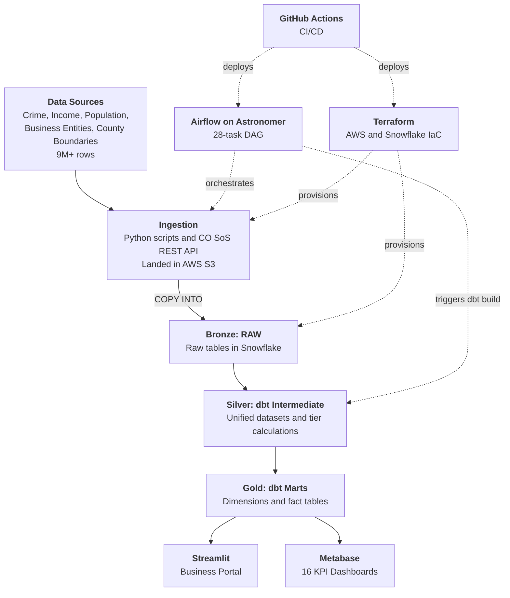
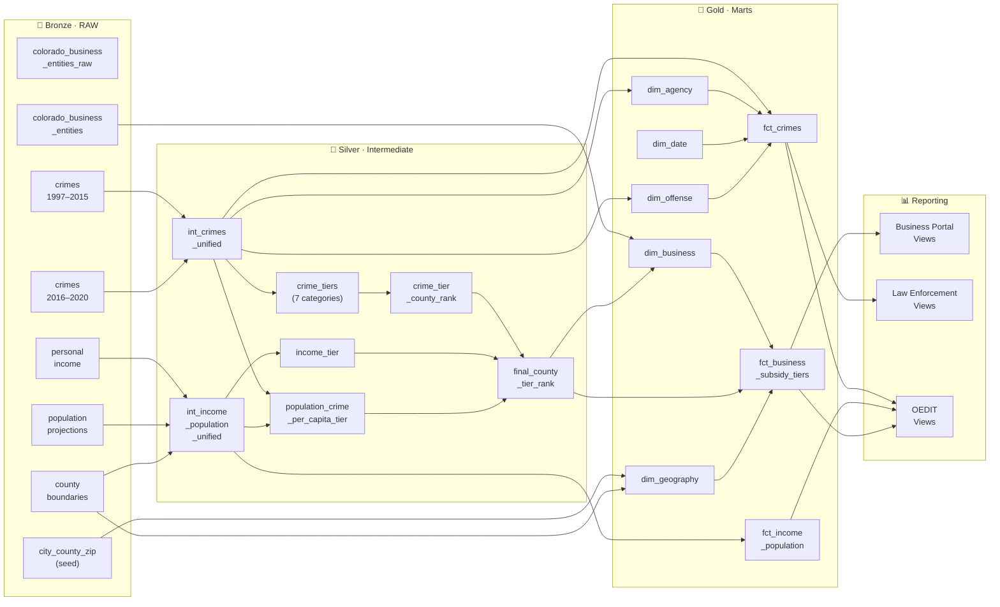
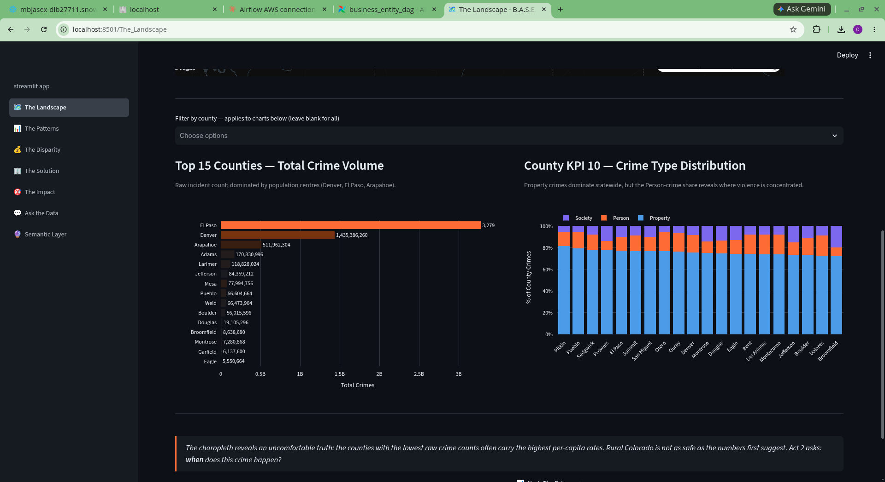
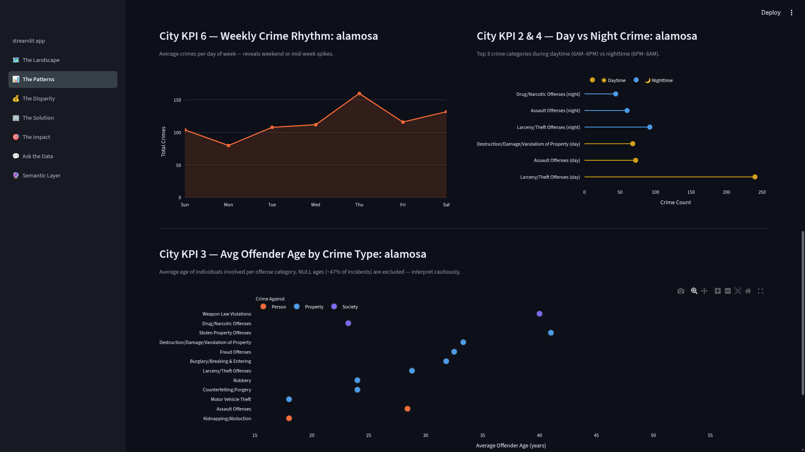
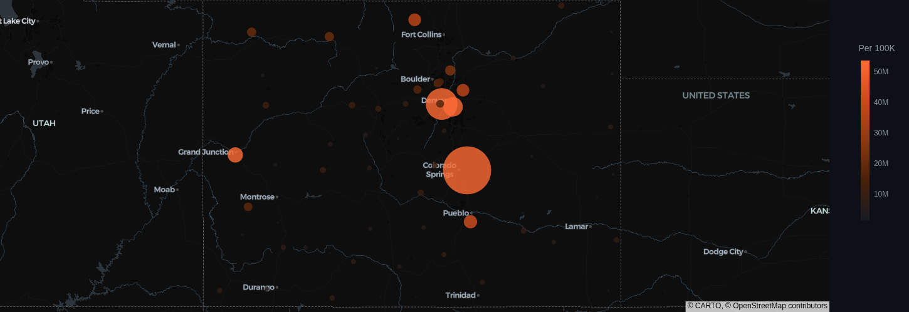
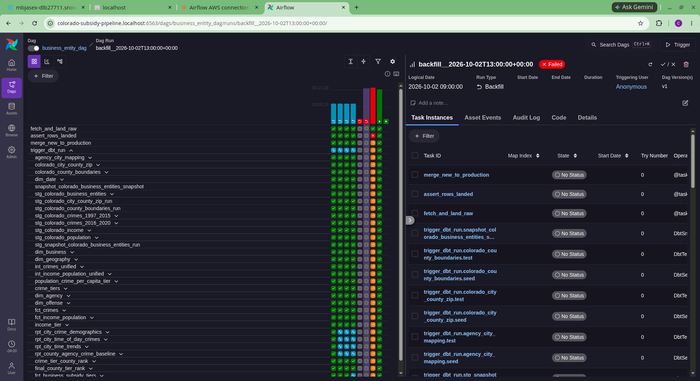
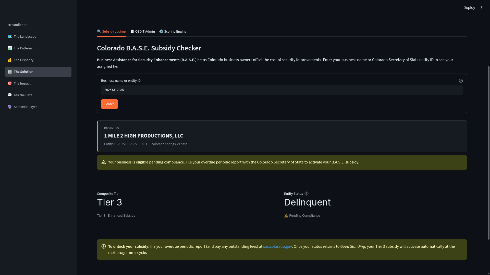
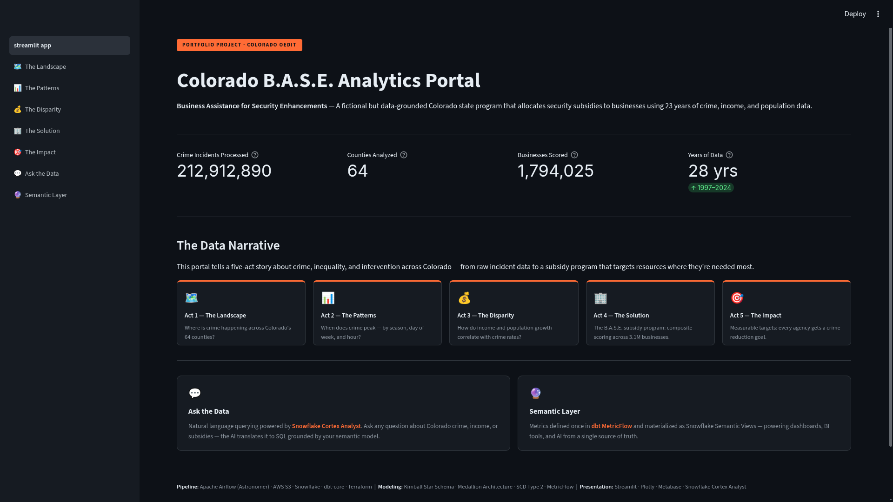

# Colorado Subsidy Data Pipeline: Empowering Civic Entities through Data

> A data engineering project unifying historical crime, population, and income data to create a trusted source of truth for Colorado's OEDIT (Office of Economic Development and International Trade) to allocate security system subsidies fairly and efficiently.

---

### 🌐 Live Demos & Data Narrative
- **Interactive Application:** [*[Streamlit App Link](https://colorado-subsidy-pipeline-base-subsidy-prtl.streamlit.app/)*]
- **Data Narrative Walkthrough:** [YouTube/Loom Video Link - *Insert URL Here*]

---

## 🎯 The Social Impact Mission (Business Case)

To accelerate sustained social impact through technology, government entities require reliable, harmonious data repositories. This fictional (but highly realistic) use case focuses on Colorado's OEDIT program.

The State of Colorado has hired your data firm to develop internal back-office visualizations and a front facing business user experience to support a critical initiative for the Office of Economic Development and International Trade (OEDIT). The program, B.A.S.E. (Business Assistance for Security Enhancements), is designed to evaluate and qualify businesses across the state for security system subsidies to protect their business based on historical crime trends, income, and population data by city and county. Historical data from 1997 to 2020, as well as new data extracted daily, will be analyzed to determine which security tiers businesses qualify for.
Additionally, the State of Colorado has sixteen KPIs and use cases they would like to see vizualized out of the extracted, transformed and aggregated data to assist them in planning, funding and outreach initiatives.
This tool will allow OEDIT to automatically notify active businesses in good standing about the subsidies they qualify for, streamlining the application process for business owners seeking to participate. Lastly, the State requires the creation of an intuitive user experience that enables businesses to search for their assigned tier, providing them with easy access to their eligibility information.

The goal was to unify disparate data sources—specifically historical crime trends, population shifts, and income data from 1997 to 2020—into a single, trusted source of truth. By eliminating administrative friction and building robust data pipelines, this project empowers decision-makers to allocate security system subsidies to businesses based on demonstrable need and data-driven human decision-making.

### KPIs and Use Cases

<details>
<summary id="county-level">County Level KPIs</summary>

1. **KPI:** Set a goal for each police agency within a given county to reduce crime by 5% within the next fiscal year, based on historical baseline data.  
   - **Model / Data Source:** `rpt_county_agency_crime_baseline`
   - **Use Case:** Calculates the total historical crime count per police agency and establishes a target metric representing a 5% reduction goal.

2. **KPI:** Bring 100% free self defense and resident safety programs to lower income counties.  
   - **Model / Data Source:** `fct_income_population`
   - **Use Case:** Calculate the average median household income per county.

3. **KPI:** Evaluate additional police agency support required in counties that show a correlation between rising population and rising crime.  
   - **Model / Data Source:** `fct_income_population`, `fct_crimes`
   - **Use Case:** Show population trends for each county alongside corresponding crime trends by year.

4. **KPI:** Identify counties with an average annual population growth rate exceeding 10% from 1997–2020, and adjust state support allocations to improve funding alignment for resident programs.  
   - **Model / Data Source:** `fct_income_population`
   - **Use Case:** Show population trends for each county from 1997–2020.

5. **KPI:** Inform police agencies of which crime categories are most prevalent in their respective county.  
   - **Model / Data Source:** `fct_crimes`
   - **Use Case:** Calculate the totals for each crime category per county from 1997 to 2020 to gauge frequency.

6. **KPI:** Enable police agencies to be proactive by identifying which months of the year have a higher volume of crime.  
   - **Model / Data Source:** `fct_crimes`
   - **Use Case:** Show average seasonal crime trends for each month by county.

7. **KPI:** Provide an interactive visual representation of crime density across counties for the entire state.  
   - **Model / Data Source:** `fct_crimes`
   - **Use Case:** Create a geo-map of crime density for counties from 1997–2020.

8. **KPI:** Drive further marketing outreach for supportive safety programs in lower income counties.  
   - **Model / Data Source:** `fct_income_population`
   - **Use Case:** Show average income per capita for counties.

9. **KPI:** Display crime rates compared to median household income to pinpoint high-risk areas.  
   - **Model / Data Source:** `fct_income_population`, `fct_crimes`
   - **Use Case:** Compare crime data with median household income for each county.

10. **KPI:** Illustrate crime type distribution by county by Property, Person and Society to better understand where to best allocate safety resources.
    - **Model / Data Source:** `fct_crimes`
    - **Use Case:** Analyze the distribution of different crime types across each county from 1997–2020 for Property, Person and Society crimes.

</details>

<details>
<summary id="city-level">City Level KPIs</summary>

1. **KPI:** Deploy an interactive dashboard displaying seasonal crime trends for each city to detect seasonal peaks to guide targeted patrol planning.
   - **Model / Data Source:** `rpt_city_time_trends`
   - **Use Case:** Uses window functions to show average monthly and day-of-week crime trends for each city.

2. **KPI:** Identify the top 3 crime categories most prevalent during daytime (6 AM–6 PM) and nighttime (6 PM–6 AM) per city.
   - **Model / Data Source:** `rpt_city_time_of_day_crimes`
   - **Use Case:** Optimizes resource allocation by determining which crimes are most likely to occur during specific patrol shifts.

3. **KPI:** Analyze average offender age and crime type distribution (Property, Person, Society) by city.
   - **Model / Data Source:** `rpt_city_crime_demographics`
   - **Use Case:** Supports the development of tailored intervention programs based on demographic and crime-type data.

4. **KPI:** Identify and report the top three crime categories most common at night (6 PM–6 AM) in each city to inform optimized night patrol scheduling.  
   - **Model / Data Source:** `rpt_city_time_of_day_crimes`
   - **Use Case:** Determine which crimes are more likely to happen at night for a city.

5. **KPI:** Develop a dynamic visualization that shows the percentage distribution of crime types by city by Property, Person and Society to support targeted law enforcement initiatives.  
   - **Model / Data Source:** `rpt_city_crime_demographics`
   - **Use Case:** Display crime type distribution by city.

6. **KPI:** Provide an analysis dashboard showing average crime trends by day of the week for each city, highlighting peak crime days to drive strategic patrol scheduling.  
   - **Model / Data Source:** `rpt_city_time_trends`
   - **Use Case:** Show crime trends on average by day of the week to determine when to patrol more.

</details>

<details>
<summary id="oedit-level">B.A.S.E. Program (OEDIT & Business Portal)</summary>

1. **KPI:** Automate B.A.S.E. subsidy tier assignments and notifications for eligible businesses.
   - **Model / Data Source:** `rpt_business_tier_lookup`
   - **Use Case:** Front-facing tier search tool allowing business owners to search their assigned subsidy tier by entity ID or name. Used by OEDIT to automatically notify eligible businesses in Good Standing.

</details>


### Data Sources

- [Crimes in Colorado (2016-2020)](https://data.colorado.gov/Public-Safety/Crimes-in-Colorado/j6g4-gayk/about_data): Offenses in Colorado for 2016 through 2020 by Agency from the FBI's Crime Data Explorer.
    - Number of rows: 3.1M
- [Crimes in Colorado (1997-2015)](https://data.colorado.gov/Public-Safety/Crimes-in-Colorado-1997-to-2015/6vnq-az4b/about_data): Crime stats for the State of Colorado from 1997 to 2015. Data provided by the CDPS and the FBI's Crime Data Explorer (CDE).
    - Number of rows: 4.95M
- [Personal Income in Colorado](https://data.colorado.gov/Labor-and-Employment/Personal-Income-in-Colorado/2cpa-vbur/about_data): Income (per capita or total) for each county by year with rank and population. From Colorado Department of Labor and Employment (CDLE), since 1969.
    - Number of rows: 10k
- [Population Projections in Colorado](https://data.colorado.gov/Demographics/Population-Projections-in-Colorado/q5vp-adf3/about_data): Actual and predicted population data by gender and age from the Department of Local Affairs (DOLA), from 1990 to 2040.
    - Number of rows: 382k
- [Business Entities in Colorado](https://data.colorado.gov/Business/Business-Entities-in-Colorado/4ykn-tg5h/about_data): Colorado Business Entities (corporations, LLCs, etc.) registered with the Colorado Department of State (CDOS) since 1864.
    - Number of rows: 2.81M
- [Colorado County Boundaries](https://data-cdphe.opendata.arcgis.com/datasets/CDPHE::colorado-county-boundaries/about): This feature class contains county boundaries for all 64 Colorado counties and 2010 US Census attributes data describing the population within each county.
    - Number of rows: 64
---

## 🏗 Architecture & Data Infrastructure

This project leverages a **Medallion Architecture** (Bronze, Silver, Gold) to guarantee data quality and provide a resilient foundation for downstream analytics and AI workflows. 

### High-Level System Architecture


### Data Flow — Medallion Architecture Detail



**Tech Stack:**
- **Orchestration:** Apache Airflow running in an Astronomer cloud production environment
- **Data Modeling:** Medallion Architecture (Bronze, Silver, Gold layers)
- **Languages:** Python, SQL
- **AWS:** S3 bucket storage for CSV extracts
- **Visualization:** Streamlit, Metabase
- **Astronomer:** data orchestraton platform that provides a managed service for Apache Airflow orchestrations in the cloud

---

## ⚙️ Data Pipeline & Orchestration (The Engine)

At the core of this project is a highly automated data pipeline designed for synchronous and asynchronous system integration, orchestrated by Apache Airflow. 

**DAG Flow Order (`business_entity_dag.py`):**
1. **`fetch_and_land_raw`**: Calls the Colorado Secretary of State API to fetch daily business entity records and lands the raw strings into the Snowflake bronze layer (`RAW` schema).
2. **`assert_rows_landed`**: A data quality gate that fails fast if the API returns an empty response for the target date, preventing silent data gaps.
3. **`merge_new_to_production`**: Idempotently merges net-new entity IDs from the bronze raw table into the production source table.
4. **`trigger_dbt_run`**: A Cosmos `DbtTaskGroup` that executes the dbt DAG (staging, intermediate, and marts layers) to handle all downstream transformations, filtering, and tier enrichment.

*(📸 **Screenshot Placeholder:** Insert a screenshot of the Airflow UI showing the DAG graph view here to highlight workflow automation.)*

---

## Business Entity Tier Ranking

### Subsidy Tiers

Tiers are represented as a range of 1 through 4 in the B.A.S.E. program. 1 indicates the lowest level need and 4 indicates the highest level need for security system subsidies. Each subsidy tier below offers a gradual increase of security system services based on the tier that your business qualifies for. The idea is that tiers will be backfilled and assigned on the source business entities dataset and as new business entities are added daily to the Colorado Information Marketplace, those records will also be assigned a tier through the Airflow orchestration that we will cover below. However, how are tiers actually calculated and assigned?


### How Tiers Are Calculated and Assigned

<details>
<summary id="step-1-identify-criteria"><strong>Step 1: Identify Criteria</strong></summary>

- **Crimes:**  
  Out of all the crime categories that exist, the pipeline focuses on 7 property-related or adjacent crimes (configurable via the `crime_categories` variable in `dbt_project.yml`):
  - Destruction/Damage/Vandalism of Property
  - Burglary/Breaking & Entering
  - Larceny/Theft Offenses
  - Motor Vehicle Theft
  - Robbery
  - Arson
  - Stolen Property Offenses

- **Population-Adjusted Crime:**  
  Calculate the average annual crime per capita (crimes per 1,000 residents) for each county using historical crime and population data.

- **Income:**  
  Determine the average median household income for each county over the historical period.

</details>

<details>
<summary id="step-2-establish-individual-rankings"><strong>Step 2: Establish Individual Rankings (dbt Intermediate Models)</strong></summary>
<br/>
For each metric, we transform raw data into a standardized tier (1-4) by computing percentile ranks across all counties:

#### Crime Categories (`crime_tiers.sql`)
For each of the selected crime categories:
- **Aggregate Data:** Count the total incidents per county for that specific category.
- **Compute Percentile Ranks:** Use `percent_rank() over (partition by offense_category_name order by total_crimes)` to determine each county's standing.
- **Assign Tiers:** Counties with the highest counts (≥ 75th percentile) get Tier 4. Tiers step down to Tier 1 (< 25th percentile). Higher tier = more crime = more B.A.S.E. need.

#### Population-Adjusted Crime (`population_crime_per_capita_tier.sql`)
- **Calculate Yearly Crime Rates:** Join yearly crime counts with population figures.
- **Averaging:** Compute the average crime rate per 1,000 residents for each county.
- **Ranking & Assign Tiers:** Compute `percent_rank()` based on the average rate. Counties in the top 25% get Tier 4, scaling down to Tier 1 for the lowest crime per capita. 

#### Income (`income_tier.sql`)
- **Aggregate Income Data:** Calculate the average median household income per county.
- **Compute Percentile Ranks:** Establish how each county compares to others based on this average.
- **Assign Tiers (Inverse Logic):** For income, lower income means greater need. Counties in the highest income percentiles (≥ 75%) receive Tier 1 (lowest need). The lowest income counties (< 25%) receive Tier 4 (highest need).

Below is an example of how the crime tiers are computed in dbt:

```sql
-- Excerpt from models/intermediate/crime_tiers.sql
with county_crime_counts as (
    select
        county_name,
        offense_category_name,
        count(*) as total_crimes
    from crimes
    where offense_category_name in ('{{ var("crime_categories") | join("', '") }}')
    group by county_name, offense_category_name
),
percentile_ranked as (
    select
        county_name,
        offense_category_name,
        total_crimes,
        percent_rank() over (partition by offense_category_name order by total_crimes) as crime_percentile
    from county_crime_counts
)
select
    lower(trim(county_name)) as county_name,
    offense_category_name,
    total_crimes,
    crime_percentile,
    case
        when crime_percentile >= 0.75 then 4
        when crime_percentile >= 0.50 then 3
        when crime_percentile >= 0.25 then 2
        else 1
    end as crime_tier
from percentile_ranked
```

</details>

<details>
<summary id="merge-individual-crime-rankings"><strong>Step 3: Merge Individual Crime Rankings (`crime_tier_county_rank.sql`)</strong></summary>
<br/>

After calculating individual tiers for the crime categories, we pivot the data to create a single row per county with an overall crime tier score. 
The process involves:
- **Pivoting Data:** Using conditional aggregation (`max(case when ... then crime_tier end)`) to pivot the 7 offense categories into separate columns.
- **Calculating Overall Tier:** Averaging the 7 individual crime tiers for each county and rounding to the nearest whole number.

```sql
-- Excerpt from models/intermediate/crime_tier_county_rank.sql
select
    county_name,
    max(case when offense_category_name = 'Destruction/Damage/Vandalism of Property' then crime_tier end) as property_destruction_tier,
    -- (Other categories omitted for brevity)
    max(case when offense_category_name = 'Stolen Property Offenses' then crime_tier end) as stolen_property_tier,
    round(avg(crime_tier)) as overall_crime_tier
from crime_tiers
group by county_name
```

</details>

<details>
<summary id="final-county-tier"><strong>Step 4: Merge Rankings for Final County Tier Rank (`final_county_tier_rank.sql`)</strong></summary>
<br/>
In this step, we combine the overall crime tier, the income tier, and the population (crime per capita) tier to generate a final composite ranking for each county.

The merging process involves:
- **Combining Ranks:** We perform a `FULL OUTER JOIN` on the three ranking tables to ensure every county is represented.
- **Calculating the Final Rank:** The final rank is computed as the average of the available rankings. We use conditional logic (`case when rank > 0 then 1 else 0 end`) in the denominator to only divide by the number of metrics actually present for a given county.
- **Final Result:** The output is a single composite tier score for every county in Colorado.

```sql
-- Excerpt from models/intermediate/final_county_tier_rank.sql
with combined as (
    select
        lower(trim(coalesce(c.county, i.county, p.county))) as county,
        coalesce(c.crime_rank, 0) as crime_rank,
        coalesce(i.income_rank, 0) as income_rank,
        coalesce(p.population_rank, 0) as population_rank
    from crime_rank as c
    full outer join income_rank as i on lower(trim(c.county)) = lower(trim(i.county))
    full outer join population_rank as p on coalesce(lower(trim(c.county)), lower(trim(i.county))) = lower(trim(p.county))
)
select
    county,
    crime_rank,
    income_rank,
    population_rank,
    round(
        (crime_rank + income_rank + population_rank) /
        nullif((case when crime_rank > 0 then 1 else 0 end + 
                case when income_rank > 0 then 1 else 0 end + 
                case when population_rank > 0 then 1 else 0 end), 0)
    ) as final_rank
from combined
```

</details>

<details>
<summary id="backfill-business-entities"><strong>Step 5: Assign Tiers to Eligible Businesses (`fct_business_subsidy_tiers.sql`)</strong></summary>
<br/>
In the final step (Gold layer), we join the composite county tier rank with the business entities dimension table (`dim_business`) to determine final B.A.S.E. subsidy eligibility.

Key logic in this step:
- **County Matching:** We join the business's principal county to the county tier table using a case-insensitive match.
- **Status Filtering:** We only include businesses with active/correctable statuses ('Good Standing', 'Exists', 'Delinquent', 'Noncompliant').
- **Eligibility & Compliance Flags:** 
  - A business must be in 'Good Standing' or 'Exists' to be marked as `Compliant`.
  - A compliant business with a `composite_tier >= 3` is marked as `qualifies_for_subsidy = true` and is eligible for notifications.
- **Tier Labels:** Tiers are translated into descriptive labels (e.g., Tier 4 -> 'Maximum Subsidy', Tier 1 -> 'Basic Review').

```sql
-- Excerpt from models/marts/facts/fct_business_subsidy_tiers.sql
select
    business_key,
    entity_name,
    principal_county,
    entity_status,
    round(composite_tier) as composite_tier,
    case
        when entity_status in ('Good Standing', 'Exists') then 'Compliant'
        when entity_status in ('Delinquent', 'Noncompliant') then 'Pending Compliance'
    end as compliance_status,
    case
        when entity_status in ('Good Standing', 'Exists') and coalesce(round(composite_tier) >= 3, false) then true
        else false
    end as qualifies_for_subsidy
from joined
where composite_tier > 0
```

</details>

## KPI and Use Case Visualizations

These dashboards represent the 16 KPIs and use cases that were provided to the data firm by the state. Please note as well that Grafana allows us to create dynamic variables that enable us to choose our city or county and fetch dynamic data from those values in real time for visualization. Since these are static images, that will not be represented here, but is a huge component to the user experience. 

### Colorado County Dashboard

This county dashboard shows the following use cases:
- Calculate crime count for police agencies in a given county to get a baseline number.
- Calculate the average median household income per county.
- Show population trends for each county alongside corresponding crime trends by year.
- Show population trends for each county from 1997–2020.
- Calculate the totals for each crime category per county from 1997 to 2020 to gauge frequency.
- Show average seasonal crime trends for each month by county.
- Create a geo-map of crime density for counties from 1997–2020.
- Show average income per capita for counties.
- Compare crime data with median household income for each county.
- Analyze the distribution of different crime types across each county from 1997–2020 for Property, Person and Society crimes.
  



### Colorado City Dashboard

This city dashboard shows the following use cases: 

- Show seasonal crime trends for the year in each city.
- Determine which crimes are more likely to happen during the day for a city.
- Compute the average age for crime categories across cities.
- Determine which crimes are more likely to happen at night for a city.
- Display crime type distribution by city.
- Show crime trends on average by day of the week to determine when to patrol more.
  


### Colorado Crime Density Dashboard

This dashboard shows overall crime density on crime per capita (100k) residents across the entire State of Colorado. Its cool to see the larger areas represent the highest density and its not surprising that many of those are in the metro area of Denver.



### Business Entity Data Pipeline

#### Business Entity Daily DAG (`business_entity_dag.py`)

The final part of the equation is our data pipeline that evaluates newly incoming business entities daily. This DAG fetches yesterday's Colorado Business Entity data for processing, ensures data quality, merges net-new entities, and triggers the dbt transformations to assign the appropriate B.A.S.E subsidy tier.

---

#### DAG Flow Order

The DAG is built with Astronomer Cosmos to seamlessly integrate Airflow with dbt, executing in this explicit order:

1. **`fetch_and_land_raw`**  
   *Description:* Calls the Colorado Secretary of State API to fetch daily business entity records and lands the raw JSON responses into the Snowflake bronze layer (`RAW` schema) as strings.

2. **`assert_rows_landed`**  
   *Description:* Acts as a data quality circuit breaker. It queries the bronze layer to ensure records were actually landed for the target date. If the API returned empty results, this task fails fast to prevent silent data gaps.

3. **`merge_new_to_production`**  
   *Description:* An idempotent merge operation that takes the raw landed data, parses the JSON, and merges net-new entity IDs into the production source table (`raw_business_entities`).

4. **`trigger_dbt_run`**  
   *Description:* A Cosmos `DbtTaskGroup` that executes the full dbt DAG (staging, intermediate, and marts layers). This handles all downstream cleaning, joining matching County data based on Zip and City, and enriching the businesses with their calculated B.A.S.E subsidy tier.



#### Astronomer Cloud Deployment

Below are snapshots of my DAG in the Astronomer production environment running daily.


This capture also shows the successes and failures of my DAG runs as I worked through errors and bugs.

### Putting It All Together

#### Business Entity Search Dashboard
<br/>
The dashboard below enables a business owner to navigate to this dashboard, search for their business entity and see information about their business, information on the available security system subsidy tiers and exactly which tier their business qualifies for. In this example, Lost Coffee could search for information about their business and learn that they have been assigned a tier ranking of 3 based on all of the criteria explained above. 
<br/>




## 📊 Data Democratization: BI & App Experiences

To ensure this data actually empowers stakeholders, custom consumption tools bridge the gap between raw data and actionable insight.

### 1. Public-Facing App (Streamlit)
A responsive user experience that allows Colorado business entities to search for their business, understand the subsidy tier structure, and discover what tier they qualify for seamlessly.


---

## 🚀 Future ML/AI Integration

By establishing a clean, unified data repository, this infrastructure is primed for future Machine Learning integration. The current pipelines can easily support AI-enabled business intelligence—such as predictive models forecasting future crime density or dynamic subsidy allocation algorithms—ensuring safe, reliable AI autonomy in philanthropic and civic resource distribution.